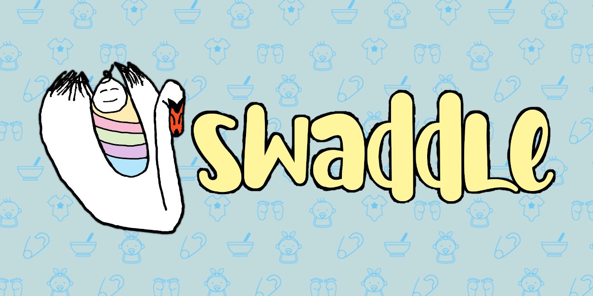

<h1 align="center">Welcome to Swaddle 👋</h1>

> Swaddle is an app that sets out to solve the problem of letting your baby sitter know more important details about your child that are usually helpful to know.

### 🏠 [Github Homepage](https://github.com/npgockel/project-kapf/)

### ✨ Deployed through Heroku at [Swaddle.care](http://www.swaddle.care/)
***
## 🤝 Contributing
Contributions, issues and feature requests are welcome! Feel free to check [issues page](https://github.com/npgockel/project-kapf/issues). 

***
## Built With

* [bcrypt.js](https://www.npmjs.com/package/bcryptjs)
* [dotenv](https://www.npmjs.com/package/dotenv)
* [Cloudinary](https://cloudinary.com/)
* [Express](https://expressjs.com/)
* [express-session](https://www.npmjs.com/package/express-session)
* [@material-ui/icons](https://www.npmjs.com/package/@material-ui/icons)
* [Material UI Image](https://www.npmjs.com/package/material-ui-image)
* [Material-UI pickers](https://www.npmjs.com/package/@material-ui/pickers)
* [moment](https://www.npmjs.com/package/moment)
* [Morgan](https://www.npmjs.com/package/morgan)
* [Node MySQL 2](https://www.npmjs.com/package/mysql2)
* [Passport](https://www.npmjs.com/package/passport)
* [Passport-Local](https://www.npmjs.com/package/passport-local)
* [react-moment](https://www.npmjs.com/package/react-moment)
* [Sequelize](https://sequelize.org/)

***
## License

This project is derived from starter code licensed under the MIT License.
***
## Authors

👤 **Project-KAPF**

Ken Williams
* Github: [@kenwilliams74](https://github.com/KenWilliams74)
* Email: kenwilliams74@gmail.com
* LinkedIn: [ken-williams-fullstackcoding](https://www.linkedin.com/in/ken-williams-fullstackcoding/)
* Website: [kenwilliams74.github.io](https://kenwilliams74.github.io/)

Nectarios 'Ari' Gockel
* Github: [@NPGockel](https://github.com/NPGockel)
* Email: npgockel@gmail.com
* LinkedIn: [nectarios-gockel](https://www.linkedin.com/in/nectarios-gockel/)
* Website: [npgockel.github.io](https://npgockel.github.io/)

Prabjit Virdee
* Github: [@prabjitv](https://github.com/prabjitv)
* Email: prabjitv@gmail.com
* LinkedIn: [prabjit-virdee-54626b1a5](https://www.linkedin.com/in/prabjit-virdee-54626b1a5/)
* Website: https://prabjitv.github.io/Responsive-Portfolio/index.html

Forace Avant
* Github: [@ForaceAvant](https://github.com/ForaceAvant)
* Email: themattavant@gmail.com
* LinkedIn: [forace-avant-4805a619a](https://www.linkedin.com/in/forace-avant-4805a619a/)
* Website: [https://reactportfolioforace.herokuapp.com/](https://reactportfolioforace.herokuapp.com/)

***
The group title "KAPF" is an acronym derived from the first letters of our names, which is actually the German word for "cap."  A serendipitous title for the capstone project of our Coding Bootcamp.
***
This README was helpfully started with the [readme-md-generator](https://github.com/kefranabg/readme-md-generator)
